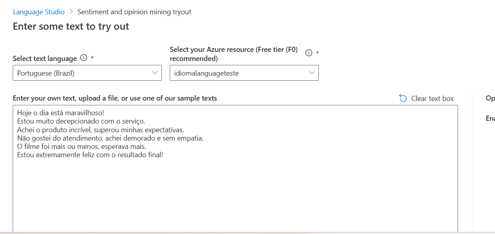
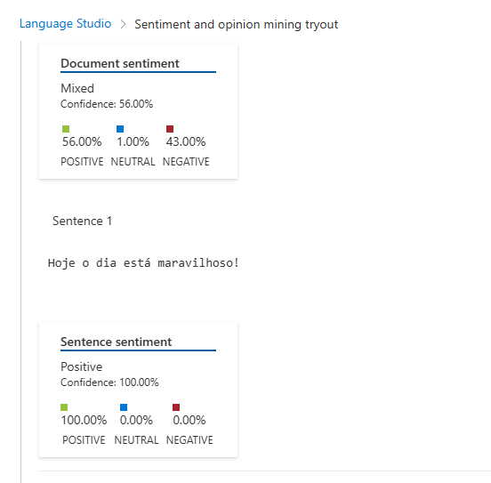

# sentiment-analysis-azure-language-studio
Bootcamp Avanade

## 📥 Sentenças Utilizadas

As sentenças estão no arquivo `inputs/sentencas.txt` e foram escolhidas para representar diferentes tonalidades de sentimento: positivo, negativo e neutro.

## 🧠 Processo

1. Acessei o [Azure AI Language Studio](https://language.azure.com/)
2. Selecionei a opção **Análise de Sentimentos**
3. Submeti o conteúdo do arquivo `sentencas.txt`
4. A IA retornou a classificação de sentimento de cada sentença (Positivo, Negativo, Neutro), além de pontuações de confiança

## 🖼️ Prints


*Tela da ferramenta com as sentenças submetidas*


*Resultado da análise com classificações e scores*

## 💡 Insights e Possibilidades

- A IA reconheceu bem a polaridade das frases, mesmo em português
- Frases ambíguas como "mais ou menos" foram interpretadas como **neutras**
- A ferramenta fornece **score de confiança** que pode ser útil em dashboards
- Aplicações possíveis:
  - Análise de reviews de clientes
  - Monitoramento de redes sociais
  - Chatbots mais empáticos

## 🚀 Possíveis Melhorias

- Automatizar o envio de sentenças via API do Azure
- Gerar gráficos com os resultados usando Python + Matplotlib
- Aplicar em dados reais de reviews de produtos

## 👨‍💻 Autor

Seu Nome — [seu perfil no GitHub](https://github.com/seuusuario)

---

## 📎 Como Rodar o Projeto

Você pode clonar este repositório e testar com suas próprias sentenças no Language Studio:

```bash
git clone https://github.com/seuusuario/nome-do-repo.git

